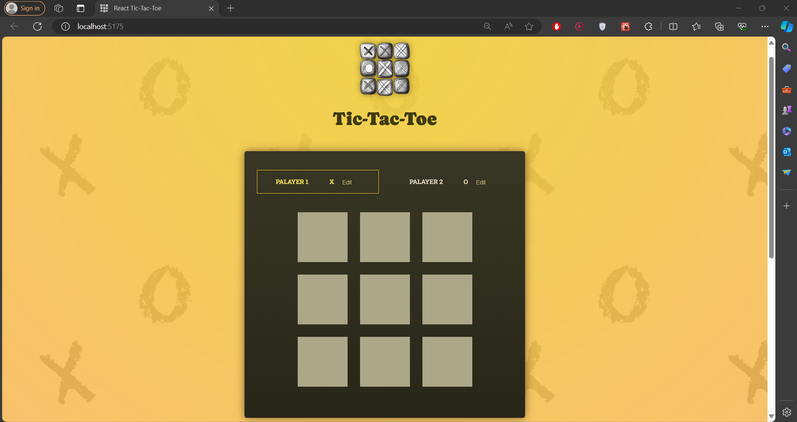
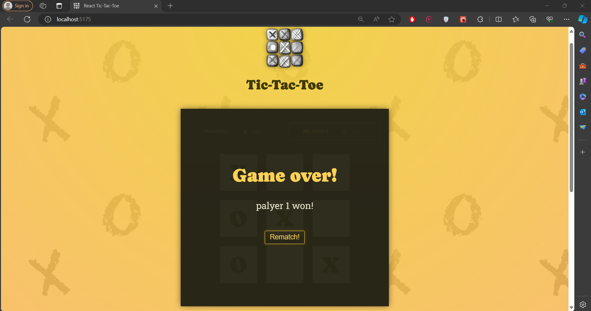
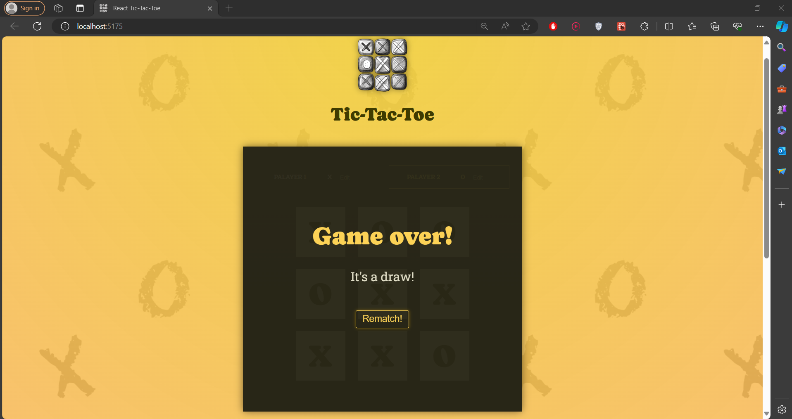

# Tic-Tac-Toe Game with React
This project is a simple implementation of the classic game Tic-Tac-Toe using React, a popular JavaScript library for building user interfaces. The game allows two players to take turns marking spaces on a 3x3 grid, aiming to get three of their symbols in a row, column, or diagonal.

## Features:
Responsive Design: The game is designed to be responsive, ensuring an optimal experience across various devices and screen sizes.
Turn-Based Gameplay: Players take turns marking spaces on the board until one player wins or the game ends in a draw.
Winning Detection: The game automatically detects when a player has won by achieving three of their symbols in a row, column, or diagonal.
Draw Detection: If all spaces on the board are filled without a winner, the game ends in a draw.
Restart Option: Players can restart the game at any time to play again.
## Technologies Used:
React: The game is built using React to manage the state of the application and render the user interface components efficiently.
HTML/CSS: Basic HTML and CSS are used for structuring the game interface and styling it for an engaging user experience.
## Contribution:
Contributions are welcome! If you find any bugs or want to improve the game, feel free to open an issue or submit a pull request.

## Credits:
This project is inspired by React - The Complete Guide 2024 (incl. React Router & Redux).

## License:
This project is licensed under BenHammouda Mohamed Ali.

### Dashboard:

### Player won !:

### Draw:

